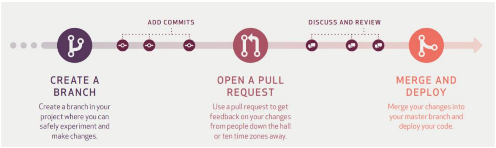
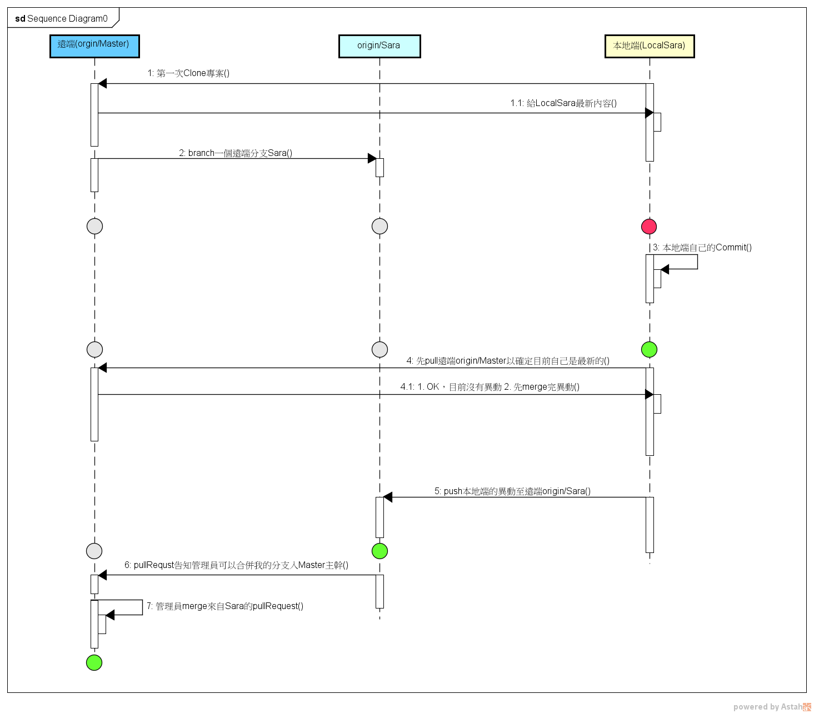

# Git 團隊工作

- 日期 : 2021/9/16

## GitHub Workflow

## 工作示意圖

## 我是第一次

1. `clone`來自遠端的repository
2. 在遠端開一條origin/Master的分支並且命名(自己的分支)
3. 開始工作

## 重要步驟

1. `pull`遠端`origin/Master`的最新版本入我的本地端
2. 作一些小成果，該存檔，想告一段落了
3. `add to stage`放進`暫存區`
4. `commit`並且寫一些關鍵訊息來清晰表達我這次做了什麼事

*以上是本地端作業*

---

*以下是遠端作業*

1. 看情況將內容`push`到**我自己**的遠端分支

   - 可能覺得做的量太少，不想一直push
2. 我本地端覺得OK了，該`push`到**我自己**的分支了
3. 先`pull`遠端`origin/Master`的最新內容

   - 也可以先`fetch`看看[^註]

   - 因為怕有新的內容已在遠端而我沒有更新到，如果push上去會有衝突發生
4. `push`到**我自己**的分支
5. 在遠端**我自己**的分支，撰寫`pullRequest`告知異動

   - 目的是讓遠端管理Master主幹的人能夠了解你要merge的大概內容以及注意事項，以方便當merge發生衝突時，可以參考
6. 管理員`merge`遠端所有分支的`pullRequest`

[^註]: pull指令 = fetch指令 + merge指令；順便看看別人的進度

